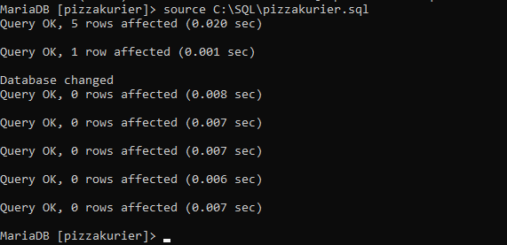

## Aufgabe 2.3: Datenbank Schema mit SQL/DDL erstellen

in dieser Aufgabe mussten wir einen Script schreiben, der fünf Tabellen generiert (Customer, Product, Order, Product_Category und Product_has_Order)

Ich werde unten erlären was die einzelnen Befehle in dem Script machen.

---

In diesem Teil von dem Script schaut der Script, ob eine Datenbank mit dem Namen "pizzakurier" vorhanden ist, wenn diese Vorhanden wäre würde diese gelöscht werden, und mit `CREATE DATABASE pizzakurier;` wieder erstellt werden. Das Löschen übernimmt `DROP DATABASE IF EXISTS pizzakurier;`. Es wird auch sichergestellt, dass die Datenbank pizzakurier auch wirklich verwendet wird, dies geschieht mit dem Befehl `USE pizzakurier;`

``` SQL
DROP DATABASE IF EXISTS pizzakurier;
CREATE DATABASE pizzakurier;
USE pizzakurier;
```
--- 

In diesem Part wird bestimmt wie die Tabelle `customer` generiert werden sollte. Hier werden ausserdem die einzelnen Attributen eingeschrieben. `id` wäre zum beispiel der Name des Attributs und `INT` wäre der Datentyp. `ATO_INCREMENT` und `NOT NULL` wären dann die einzelnen Optionen

In diesem ganzen Code-Snippet, den man unten sehen kann werden fünf Tabellen generiert mit ihren Entitäten also Tabellennamen und Attributen bzw. Attributsnamen wie `id`. Dies habe ich oben ja schon erwähnt. Ausserdem werden ganz unten in den jeweiligen Befehlen, die die Tabellen generieren erwähnt welches Attribut als `PRIMARY KEY()` deklariert wird. Ausserdem sieht man auch `FOREIGN KEY FK_[FOREIGNKEYNAME] REFERENCES TABLENAME()`. Dieser Teil bestimmt welches Attribut in einer Tabelle ein Foreign Key oder Fremdkey ist. Der Befehl zeigt ausserdem auch auf welche Tabelle diese Foreign Keys verweissen.

⚠️⚠️WICHTIG⚠️⚠️

Schaue auf den Ablauf des Scripts, denn der Script wird von Oben nach unten durch geführ, dass heisst wenn man Foreign Keys in den gewissen Tabellen hat, und diese an den Anfang des Scripts setzt. Ist es so, dass die Datenbank einen ERROR ausspuckt, da der Foreign Key bzw. der Primary Key der Tabelle noch nicht generiert wurde.

Man sollte ausserdem auch auf den Namen seiner Tabellen achten. In unserem Fall wurde der englischen Namen für die Tabelle `Bestellung` verwendet, dass heisst das der Befehl für die Tabelle `CREATE TABLE order ()` hiess. Jedoch ist `ORDER` ein Befehl in SQL. Dass heisst man muss diesen Namen ausquotieren bzw. mit schrägen Stringzeichen als String markieren. Alternativ kann man auch die normalen `"` für die Markierung verwenden.

``` SQL

CREATE TABLE customer (
id INT AUTO_INCREMENT NOT NULL,
name VARCHAR(100) NOT NULL,
postal_code INT NOT NULL,
location VARCHAR(45) NOT NULL,
email VARCHAR(255) NOT NULL,
phone VARCHAR(45) NOT NULL,
PRIMARY KEY(id)
);

CREATE TABLE order (
    id INT AUTO_INCREMENT NOT NULL,
    quantity INT NOT NULL,
    orderdate TIMESTAMP NOT NULL,
    deliverydate TIMESTAMP DEFAULT NULL,
    customer_id INT NOT NULL,
    PRIMARY KEY(id),
    FOREIGN KEY (customer_id) REFERENCES customer(id)
);

CREATE TABLE product_category(
    id INT NOT NULL AUTO_INCREMENT,
    name VARCHAR(255) NOT NULL,
    description VARCHAR(255) NOT NULL,
    PRIMARY KEY(id)
);

CREATE TABLE product (
id INT AUTO_INCREMENT NOT NULL,
name VARCHAR(255) NOT NULL,
description VARCHAR(255) NOT NULL,
price DECIMAL(6,2) NOT NULL,
product_category INT NOT NULL,
PRIMARY KEY(id),
FOREIGN KEY (product_category) REFERENCES product_category(id)
);

CREATE TABLE product_has_order(
    product_id INT NOT NULL,
    product_category_id INT NOT NULL,
    order_id INT NOT NULL,
    customer_id INT NOT NULL,
    FOREIGN KEY (product_id) REFERENCES product(id),
    FOREIGN KEY (product_category_id) REFERENCES product_category(id),
    FOREIGN KEY (order_id) REFERENCES order(id),
    FOREIGN KEY (customer_id) REFERENCES customer(id)
);

``` 

#### Was waren unsere Probleme bei diesem Auftrag

Unsere Probleme waren:
1. Dass wir den Namen unserer Tabelle auf `order` ohne sie als String zu markieren als namen festgelegt haben.
2. Dass wir die Abfolge unserer Tabellen falsch hatten, wir hatten die Tabellen, die einen Foreign key hatten zu oberst.

#### Funktioniert unser SQL-Script

Wie man in unterem Bild sieht funktioniert unser Script einwandfrei.

